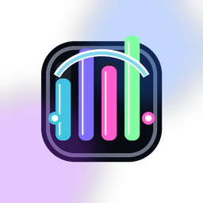

# Hercules Wave Bridge



Turn a Hercules Stream 100 into a physical controller and live display for
Elgato Wave Link on Windows.

## Features

- Four Stream 100 encoders control the first four eligible Wave Link channels by
  default. Each encoder can instead control Personal Mix itself or Personal Mix
  Audio Output 1.
- Encoder presses toggle mute for the selected channel or output target.
- Live channel names, application icons, volume markers, and Windows Core Audio
  peak meters appear on the Stream 100 display.
- Action buttons send previous, play/pause, next, and launch Wave Link.
- Background choices include the built-in console design, a user image, or live
  Spotify album artwork from Windows Global Media Controls.
- Tray settings cover encoder mapping, VU style and color, knob sensitivity,
  channel-to-process meter overrides, background selection, reconnect actions,
  and startup.
- No audio recording, loopback capture, cloud service, or Spotify login.

## Requirements

- Windows 10 or Windows 11, 64-bit.
- Hercules Stream 100 (`VID_06F8`, `PID_E053`).
- [Hercules Stream Control](https://www.hercules.com/en/stream-control/)
  installed for the official HSM driver and display runtime.
- Elgato Wave Link 3.x running locally.

Hercules Stream Control must be closed while the bridge owns the controller.
The bridge offers to close it when starting.

## Install

1. Install Hercules Stream Control, including its device driver, and restart
   Windows when prompted.
2. Install and start Elgato Wave Link.
3. Download `Hercules-Wave-Bridge-Setup.exe` from the latest GitHub release.
4. Run setup, then use the Hercules Wave Bridge tray icon.

The installer is currently unsigned, so Windows SmartScreen may display an
unknown publisher warning. Release notes include the SHA-256 checksum.

## Default controls

| Control | Action |
| --- | --- |
| Encoder 1-4 turn | Adjust mapped Wave Link channel volume |
| Encoder 1-4 press | Toggle the mapped channel or output mute |
| Action button 1 | Previous media |
| Action button 2 | Play/pause |
| Action button 3 | Next media |
| Action button 4 | Launch Wave Link |

Use **Encoder Mapping** in the tray menu to switch any encoder from its default
channel to **Personal Mix** or **Personal Mix - Audio Output 1**. Personal Mix
changes Wave Link's mix-level fader; Audio Output 1 changes the physical output
level and follows whichever device is currently routed to the first mix.

## How the vendor runtime is handled

This project does not redistribute Hercules software, drivers, SDK files, or
artwork. At startup it locates the SDK installed by the official Hercules
installer under `C:\Program Files\Hercules\HSM Series\sdk` and copies the
required runtime files into the current user's local application-data folder.

This keeps the downloadable installer independent while requiring every user
to obtain Hercules' software under its own license.

## Build

Install the [.NET 9 SDK](https://dotnet.microsoft.com/download/dotnet/9.0), then:

```powershell
./scripts/Build-Release.ps1
```

The script restores dependencies, runs tests, publishes the self-contained
single-file application, builds the installer, and writes release checksums to
`artifacts/release`.

## Local data

Settings, processed backgrounds, locally provisioned Hercules runtime files,
and rotating logs live under:

```text
%LOCALAPPDATA%\HerculesWaveBridge
```

Uninstall keeps this folder so upgrades do not erase user settings.

## Compatibility and support

The Wave Link JSON-RPC endpoint and Hercules display API are undocumented and
may change in future vendor releases. Please include the Wave Link version,
Hercules Stream Control version, and relevant bridge log lines with bug reports.

## Legal

This is an independent interoperability project and is not affiliated with or
endorsed by Guillemot/Hercules, Corsair/Elgato, or Spotify. Their names and
trademarks identify compatible products only. Project source and original
assets are released under the [MIT License](LICENSE); see
[third-party notices](THIRD_PARTY_NOTICES.md).
